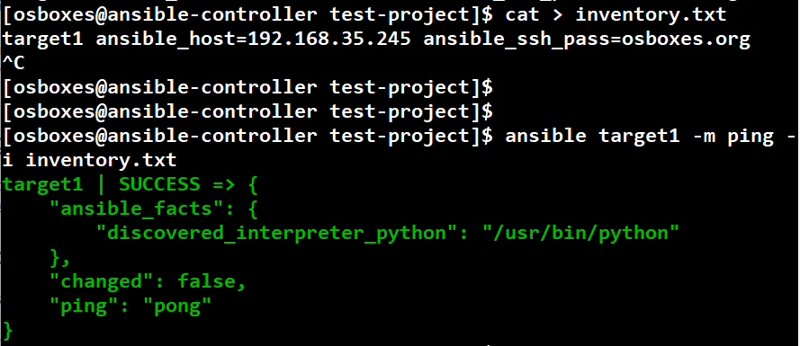

# 1. Ansible 설치부터 기본 개념 알아보기

일단 기본적인 ansible 설치과정은 다들 아실것 같아서 생략하겠습니다. 
모르시는 분들은
https://docs.ansible.com/ansible/2.5/installation_guide/intro_installation.html 이 문서를 참고하시고 따라하시면 될것같습니다
  
저는 어떤 기술을 습득할 때 우선 이론 개념부터 숙지한 후 실습을
무조건 적으로 하는 편입니다. 글로 봤을 때와 직접 해보는 것은
천지차이이고 기억으로도 오래 남기 때문입니다. 
  
그래서 앤서블 역시 제가 직접 사용해보면서 익혀보려 합니다.  

>  실습 환경은 local에 virtualbox를 이용해 실습합니다 aws ec2 나 다른 서비스를 사용할 수 있지만 일단 이번 과정에서는 간결하고 ansible 위주로 실습하겠습니다

IDC 인프라에서 정말 필요한작업인 **ansible 에대해 공부하고 사용하기** 를 해보겠습니다.
  
아래는 이번 커리큘럼 목차입니다.

1. 기본적 설치 팁과 인벤토리 작성및 핑테스트
2. 플레이북 작성 및 플레이북 실행 과 atom 적용 및 동기화
3. final project

자 그럼 한번 시작해보겠습니다.

## 1-1. 환경 소개

*local 에서 virutalbox 를 이용 3개의 서버 C# s1# s2# 을 이용합니다
  * centos7을 사용합니다.
    * 각자 환경에 맞는 리눅스 버전과 인프라 장비를 사용하시면 됩니다.
  * C# 이라고불리는 1대는 앤서블의 서버로 controler 라고 볼수 있습니다.
  * 나머지 2대는 앤서블의 호스트로
  * 서버와 호스트간에는 서로 연결될 수 있어야 합니다. 이름은 각각 slave를
    따서 s1# , s2# 으로 부르겠습니다.
    * EC2 를 쓰신다면(https://jojoldu.tistory.com/430)을 참고하셔서 포트를 열어주세요.
* 도커, VMWare 등 다른 가상 컨테이너들을 사용해 구성해도 무방합니다.
* 앤서블 서버 -> 호스트로는 접근이 되어야 합니다.

뭐가 됐든 3대의 서버만 있으시면 됩니다.

## 1-2. 왜 앤서블?

이미 잘 운영되고 있는 서버들에 **동일한 명령어를 수행해야 할 때가 있습니다**.

* 신규 입사자를 위한 서버 계정 생성
  * 클라우드에서는 ec2-user로 다 통일해서 쓰는 경우가 있는데 IDC 정책상 개발자마다 서버 계정 발급 받아 써야하는 경우가 많습니다.
* 기존 사용자의 비밀번호 변경
* 기존 사용자의 Sudo 권한 제거
 

이걸 해결하기 위해 쉘 스크립트를 이용해 전체 서버에 명령을 수행하기도 합니다.  
  

  
**전체 서버에 동일한 명령어**를 안정적으로 수행하고 **이력 관리**가 되는게 필요하면 도구의 힘을 빌리는게 편합니다.  
  
앤서블 이외에도 Puppet, Chef, Salt 등이 있습니다.  
이 중에서 앤서블을 선택한 이유는 다음과 같습니다

-자동 배포 환경이 쉬움

-활발한 오픈소스

-play book을 통한 Infrastructure as Code(작업시 노동시간 감소, 코드화에 의한 고도의 품질 보증)

-ad-hoc 지원 - 임시적으로 수행하는 의미, 작업중에 별도의 일을 하기 위해 명령어를 날리는 것 정도로 이해

-병렬 provisioning 지원 - 여러 서버를 병렬적으로 provisioning 한다는 말 같음

-멱등성을 가지고 있음

등등이 있고 또 많은 엔지니어들이 사용하고 있습니다


## 1-3. 앤서블 설치

설치 할때 pip 명령어를 사용하면 각종 다양한 os에 적용되므로 편리합니다.

공식문서를 따라가며 설치한 후 명령어를 수행해봅시다.



그리고 명령어를 한번 수행해봅니다.

```bash
ansible localhost -m ping
```

여기까지 확인되셨다면 설치가 성공적으로 되신겁니다.  
앤서블 서버 설정이 다 되었으니 호스트들을 등록하겠습니다.

## 1-4. 호스트 등록
  
앤서블은 ```/etc/ansible/hosts``` 에 있는 호스트 정보를 기본적으로 읽어갑니다.  
  
그래서 아래와 같이 ```/etc/ansible/hosts```을 열어 호스트 정보를 등록합니다.

```bash
vim /etc/ansible/hosts
```

등록 방법은 아래처럼 사용하면 됩니다.

```bash
[web]
호스트IP1
호스트IP2
```

다 등록 되셨다면 호스트로 접근이 되는지 한번 테스트 해봅니다.

```bash
ansible all -m ping
```

그럼 아래와 같이 처음으로 ssh 접속에 대한 메세지가 보입니다.  
해결책은 ```yes```를 입력하는 것입니다.


**앤서블서버**

ssh [호스트ip] 을 한번 함으로써 호스트에 접근할수 있게 됩니다. 
  

그리고 다시 한번 ping 테스트를 해봅니다.  


명령어를 실행해보시면!


ping이 성공적으로 호스트 전체에 실행된 것을 확인할 수 있습니다.


## 1-5. 다음 과정 안내

가장 첫번째 과정으로 앤서블 서버와 호스트 서버간에 연결을 해보았습니다.  
다음엔 **앤서블플레이북 작성 및 플레이북 실행을 해보겠습니다**