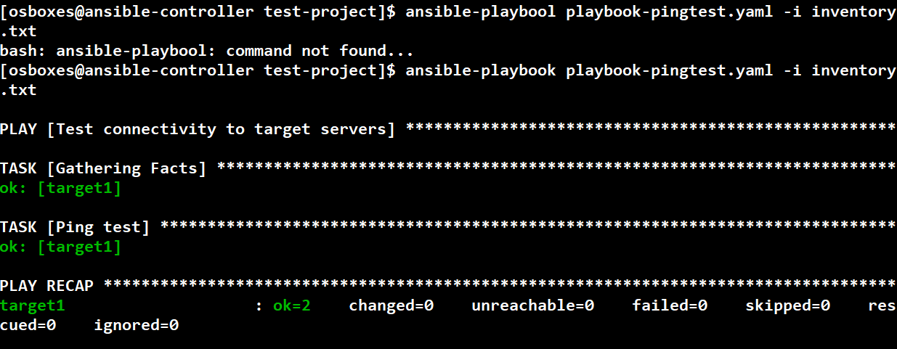
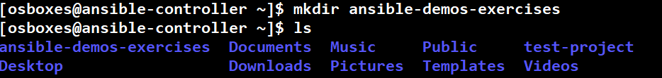
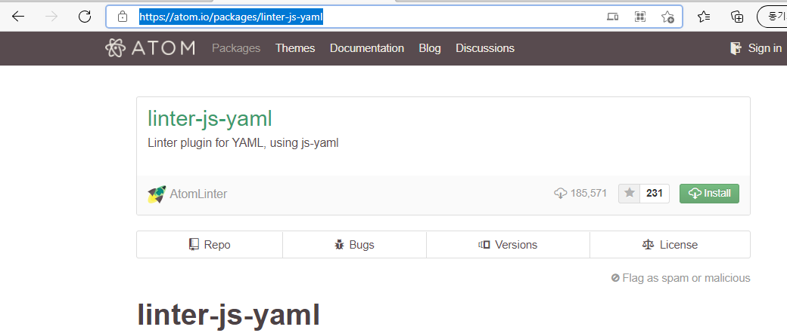
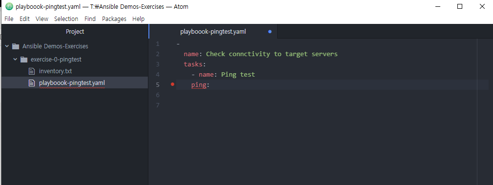
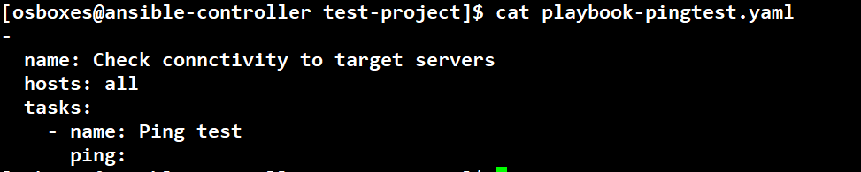
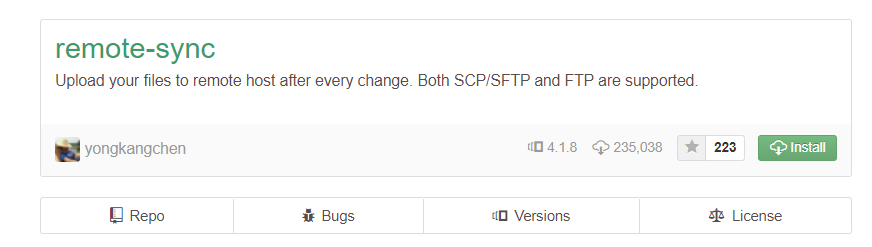
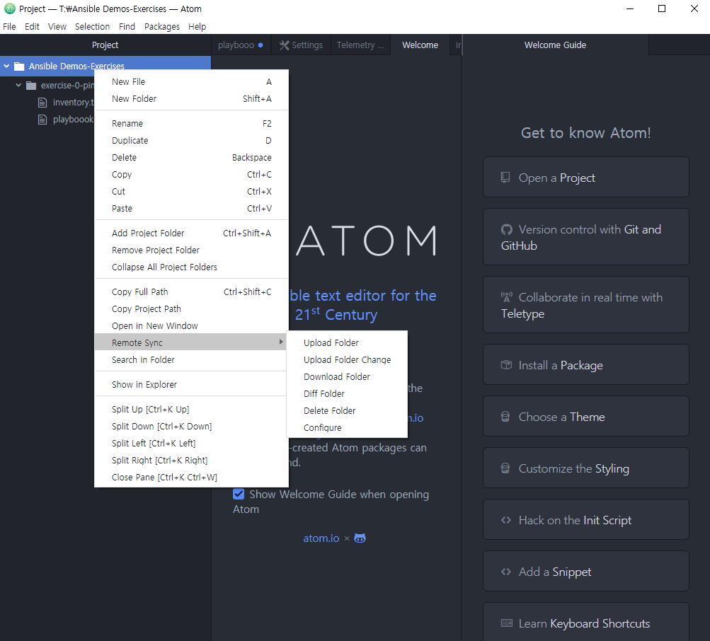
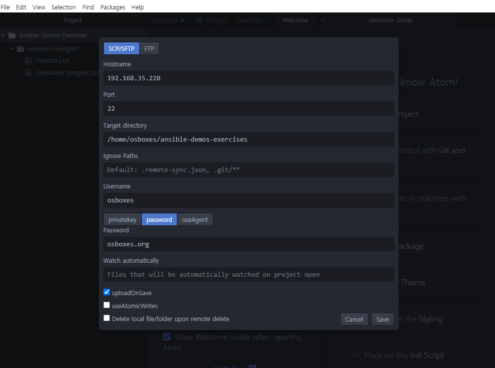
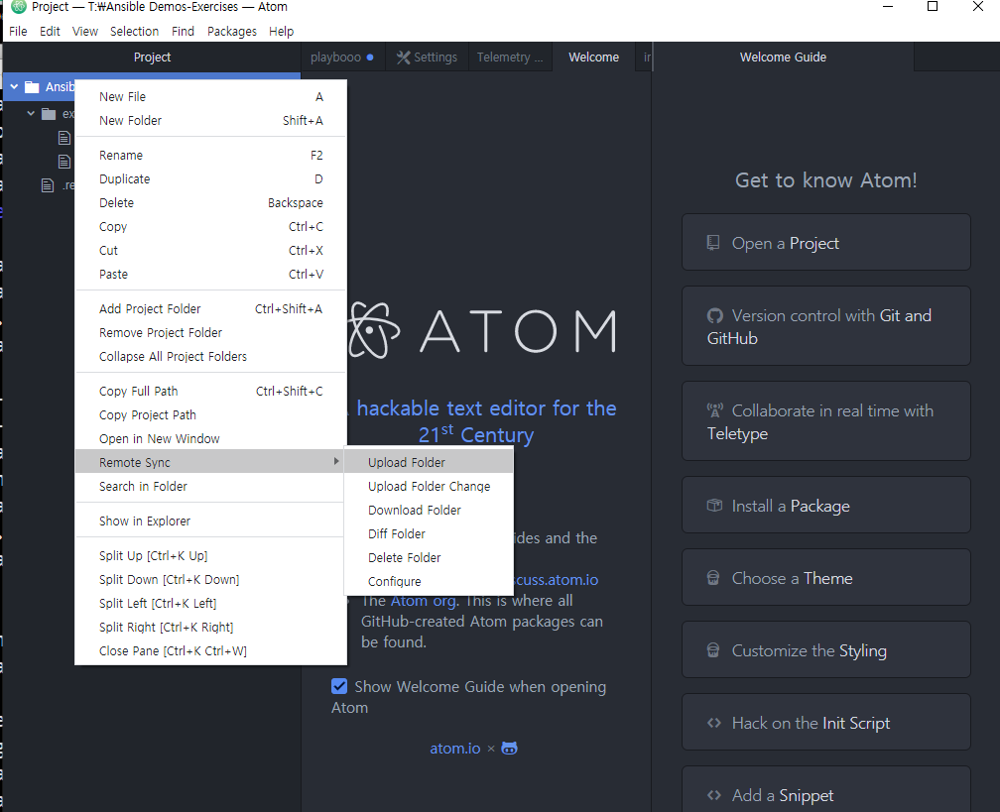

# 2.ansible play book 공부후 사용해보기

이번 시간엔 앤서블 설치를 완료한 후 play book 에 대하여 공부해보고
사용까지 해보도록 하겠습니다.

## 2-1. play book 이란

Ansible이 수행하기를 원하는 것을 정의합니다.

앤서블의 마법을 사용할 수 있도록 제공하는 지침 집합입니다.

예를 들어 일련의 명령을 실행하는 것만큼 간단할 수 있습니다.

플레이북을 개발할 때는 YAML 형식이 핵심입니다

## 2-2. 모듈이란

태스크에 의해 실행되는 다양한 작업을 모듈이라고 합니다.

이 경우 명령 스크립트는YAML,서비스는 Ansible 모듈입니다.

이러한 모듈에 대한 정보

Ansible 문서 웹 사이트에서 사용할 수 있습니다.

일단 기초적인 단계에서는 기본 명령 모듈만 알면 됩니다.


실습에 들어가기 앞서 앤서블의 모듈에 대해 간단하게 소개하겠습니다.  
앤서블의 [공식 홈페이지](https://docs.ansible.com/ansible/latest/user_guide/modules_intro.html)에선 모듈에 대해 다음과 같이 소개합니다.

여기서 짚고 넘어가야할 점은 아까 말했던 멱등성 개념과 앤서블의 특징입니다
앤서블의 모듈은 작업을 실행하기 전에 그 시점의 상태를 확인하고
변경이 있을때만 실제의 작업을 수행하도록 되어있습니다.
또 앤서블의 장점으로 가독성 , 명확한 파라미터가 존재 , 부가 정보 확인가능
, 리눅스 배포판간 호환성 보장 , 등등이 있습니다.
  
  이러한 각 모듈에 대해 사용할 수 있는 여러 모듈이 있습니다.

인스턴스 생성 및 삭제와 같은 다양한 작업을 수행할 수 있습니다.

네트워킹 및 보안에서 구성 변경 수행,

컨테이너, 데이터 센터, 클러스터, 가상 네트워킹, VSAN 관리,

그리고 더 많은 것들이요


## 3-1 play book 실습
이제 play book 과 모듈에대하여 배웠으니 실습을 해보도록 하겠습니다

첫번째 컨트롤 역할을 하는 서버 에서 적당한 디렉터리를 만든후
playbook 과 inventroy 파일을 만듭니다

안에 들어갈 내용은


```yaml
---
- name: heck connctivity to target servers
  hosts: all
  tasks:
    - name: Ping test
      ping:
```

이런 예시로 playbook 파일을 만듭니다
그리고 앞서 설명한 inventory 파일도
만듭니다

```target1 ansible_host=해당서버 ip ansible_ssh_pass=passwd
target2 ansible_host=해당서버 ip ansible_ssh_pass=passwd 
```

 inventory file 을 쉽게 풀어설명드리자면 즉 target을 설정하는
 것입니다 어느 서버에 playbook 의 작업들을 전달해서 실행시킬건지
 결정하는 문서라고 생각하시면 됩니다.

 파일을 다생성했으면

 c# 에서  ``` ansible-playbook playbook-pingtest.yaml -i inventory.txt ```
 을 실행하면 성공을 확인할수 있습니다.


## 3-2 atom 사용하여 동기화 설정해보기

**다음으로 이제 atom 을 사용하여 동기화설정을 한 후 play book , inventory 파일을 작성후에 편리하게 관리해보도록 하겠습니다.**

**atom** google 에서 검색후 설치할 수 있고

c# 서버에서 ```  mkdir ansible-demos-exercises ``` 을만든후



atom 에서도 같은 디렉터리를 만들어주시면 됩니다.
atom 에서 playbook-pingtest.yaml 을 만들고
inventory 파일도 만드는데 여기서 좋은 팁이 있습니다.
https://atom.io/packages/linter-js-yaml
이 사이트를 참고하여 위 패키지를 설치하면



atom 에서 문법체크를 바로바로 할수 있습니다.

이런식으로 문법에 문제가 있을 경우 빨간점으로 알려줍니다



이제 

```yaml
---
- name: Check connctivity to target servers
  hosts: all
  tasks:
    - name: Ping test
      ping:
```
이렇게 작성하여 playbook 파일을 저장하고



target1 ansible_host=해당서버 ip ansible_ssh_pass=passwd
target2 ansible_host=해당서버 ip ansible_ssh_pass=passwd

이렇게 inventory 파일에 저장합니다

atom 과 c# 서버 모두 작성하셔야 합니다
그런후

구글에 atom remote sysnc 을 검색하여 설치한후




이미지를 참고하여 설정을 완료한다음






atom 으로 파일을 작성한후 동기화를 누르면 c# 서버에 파일이
업로드되며 동기화 되는 것을 확인할 수 있습니다.




## 4-1. 마무리

이번 시간에는 play book 실행과 atom 동기화설정을 해보았습니다
다음 시간에는 final project 를 해보면서 ansible에 대해 기초과정보다는 조금더 심화학습을 실습해보겠습니다.