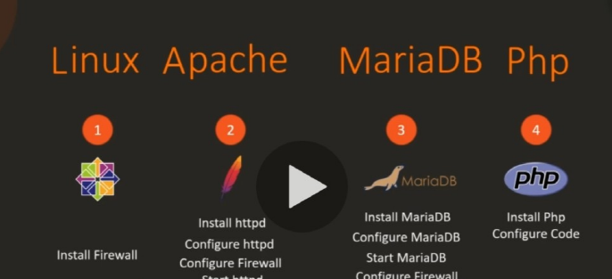

## 3-1 project 개요 설명 및 필요한 도구 설명

# 4단계 개요 

* 첫번째 

우리는 KodeKloud 전자상거래 웹사이트를 구축하기 위한 플레이북을 개발할 것입니다.

KodeKloud 전자 상거래 웹 사이트는 가상의 온라인 스토어입니다.

전자기기를 파는 곳이죠 램프 스택 응용 프로그램입니다.

그림에서 나타나는 것과 같이

* 두번째 

우리는 이 애플리케이션을 배포한 시스템을 결정할것이고
리눅스에 centos7 를 올려 배포할 것이다.

* 세번째

우리는 이 시스템 위에 Apache httpd 서버를 설치 구성할것이고

MariaDB 

php 를 선택하겠습니다.
그림을 참고해주시면 감사하겠습니다.



그리고 순서는


위 그림을 참고 해 주시면 되겠습니다


## 3-2 project 시작

# 1

기존 사용하던 c# 서버에서 시작하겠습니다 

먼저 방화벽 설치부터 시작하겠습니다.

``` #sudo yum install -y firewalld ```

``` #sudo service firewalld start ```

``` #sudo systemctl enable firewalld```

이렇게 설치후에는 service start , system enable 명령어를 
해주어야 합니다.


# 2

그런 다음 MariaDB 데이터베이스 구성을 시작합니다

설치를 시작하겠습니다.

``` #sudo yum install -y mariadb-server ```


``` #sudo service mariadb start ```

``` #sudo systemctl enable mariadb ```


마찬가지로 순서대로 명령어를 실행후에
이번엔 명령어로 확인을 해보겠습니다

``` #sudo service mariadb status ```


그런 다음 SQL 포트 3306에 액세스할 수 있도록 필요한 방화벽 규칙을 추가합니다.

그런 후에 방화벽을 다시 로드하여 해당 규칙을 적용합니다.

``` #sudo firewall-cmd --permanent --zone=public --add-port=3306/tcp ```

``` #sudo firewall-cmd --reload ```


# 3

그런 다음 MySQL 명령줄 유틸리티를 사용하여 데이터베이스로 이동합니다.

그런 다음 전자 통신 DB 데이터베이스를 만듭니다.

e-comm 사용자를 생성하고 액세스 및 플러시 권한을 부여합니다.
#mysql


``` $ mysql ```
``` MariaDB > CREATE DATABASE ecomdb; ``` 
``` MariaDB > CREATE USER 'ecomuser'@'localhost' IDENTIFIED BY 'ecompassword'; ```
``` MariaDB > GRANT ALL PRIVILEGES ON *.* TO 'ecomuser'@'localhost'; ```
``` MariaDB > FLUSH PRIVILEGES; ```

그리고 한 작업을 더 해주어야 하는데

``` #cat > db-load-script.sql ```
여기에 위의 깃 코드 에서 /github/assets/db-load-script.sql 의 주소에 코드를 해당 파일에 붙여 넣기 해주셔야합니다
이작업의 위에 나와있는 데이터 로드하는 과정입니다.

# 4

이제 마지막 단계인 나머지 필요한 패키지들을 설치해주고

그런 다음 포트 80에 대한 외부 액세스를 허용하는 방화벽 규칙을 추가합니다.

그런 다음 방화벽 규칙을 다시 로드하여 적용합니다.

``` #show databases; ```

``` #use ecomdb; ```

``` #select * from products; ```


``` #sudo yum install -y httpd php php-mysql ```


``` #sudo firewall-cmd --permanent --zone=public --add-port=80/tcp ```

``` #sudo firewall-cmd --reload ```

``` #sudo firewall-cmd --list-all ```


``` #sudo service httpd start ```

``` #sudo systemctl enable httpd ```

``` #sudo service httpd status ```


여기까지 한후 우리는 깃을 설치해야 합니다

깃을 설치해 애플리케이션 코드를 복제한후 아래 주소에

복제해야합니다.

``` #sudo yum install -y git ```


#git clone https://github.com/kodekloudhub/learning-app-ecommerce.git /var/www/html/

``` #cd /var/www/html/ ```


그리고 다음 작업으로는 아래 파일을 수정해주어야 하는데

아래파일에는 유효한 ip 가 입력되어 있지 않습니다. 
그래서 변화를 주어야 하는데 localhost 로 변경할 것입니다


 #vi index.php 


위 그림과 같이 localhost 로 변경해줍니다.

그런후에 이제 virtual box 로 들어가

firefox 로 localhost 를 검색해 주면 서비스가 잘 작동되는 것을
확인할수 있습니다.


